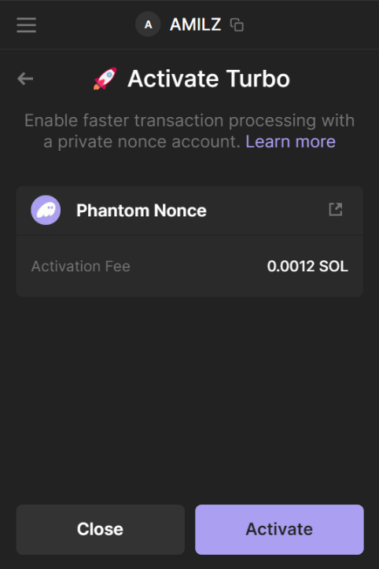

# Nonce Wallet Adapter
*Nonce to Meet You: Your Wallet's New Best Friend*

## Summary

The Nonce Wallet Adapter interface makes it easy for clients to use durable nonces. This can make transactions faster (consistent 100ms - 200ms savings experienced on Solana Pulbic Devnet) and less likely to fail.

This video shows a simulation of a simple transaction loop on Solana Public Devnet. The transaction on the left uses a nonce (using the Nonce Wallet Adapter), while the transaction on the right uses a recent blockhash. The transactions are simultaneously sent to the network. The transaction on the left is consistently ~200ms faster than the transaction on the left.


### What the Nonce Wallet Adapter? 

The Nonce Wallet Adapter is an extension of the Solana Wallet Adapter that creates an optional nonce feature for both wallet providers. It enables wallets to create a nonce account that can seamlessly be integrated on the client-side with a simple toggle and no additional signatures. This enables clients to use durable nonces to improve the user experience when executing transactions. Adapters will always default to and fall back to using the recent blockhash when a nonce account is not available.

#### What are Nonces?

Durable nonces take the place of the recent blockhash when signing transactions. Transactions using this feature have a corresponding on-chain account that stores the nonce value. The nonce value changes each time it is used to sign a transaction, such that no two transactions can be signed with the same nonce.

#### Wallet Adapter

The Nonce Wallet Adapter base class - *BaseNonceWalletAdapter* - is an implementation of the [Solana Wallet Adapter](https://github.com/solana-labs/wallet-adapter). 
- It adds an optional `nonceContainer` property to the `Wallet` interface, which contains a nonce account *PublicKey*, a nonce authority, and the current nonce value:

```typescript
export interface NonceContainer {
    nonceAccount: PublicKey
    nonceAuthority: PublicKey
    currentNonce: DurableNonce
}
```

- The wallet adapter includes a `prepareNonceTransaction` method that can be used append an `advanceNonce` instruction to a transaction.  
- The wallet adapter adds a *SendTransactionOptions* property, *useNonce*, that can be toggled on or off by the client. 
- When `sendTransaction` is invoked, the wallet adapter will check if the client has opted to use the nonce. If the client has opted to use the nonce, the wallet adapter will append an `advanceNonce` instruction to the transaction. Additionally, the wallet adapter will update the nonce account after each transaction is sent to the network.

*Example implementation: [BaseNonceWalletAdapter](packages/core/base/src/nonce.ts)*

**Note:** The current implementation is as an extension of the base Wallet Adapter, but it could be integrated directly into the Wallet Adapter if there is sufficient interest and use.

#### Wallet / User

The wallet provider - e.g. Phantom - is responsible for creating and managing the nonce account.

- The wallet will create a nonce account for each user and store the nonce account in the `nonceContainer` property.  The user should be made the authority of the nonce account, so their signature on any transaction will be valid for the `advanceNonce` instruction.
- I envision this as some type of opt-in feature that users can enable by paying rent for the nonce account. This could be marketed as something like "Turbo Mode" or "Fast Mode" that users can opt-in to. Sample UI:



*Example implementation: [InitiateNonce.tsx](packages/starter/example/src/components/nonce/InitiateNonce.tsx)*

- The wallet will also be responsible for fetching the new nonce account value after each transaction is sent to the network. Doing this after each transaction will ensure that the nonce account is always up to date and enable speedier execution of transacitons. This could be handled similar to updating a wallet's account balance after a transaction. We have included sample implementation in our *NonceWalletAdapter*.

#### Client

- Update their `sendTransaction` instruction to utilize the *useNonce* property of the *SendTransactionOptions* object when calling `sendTransaction` (`useNonce` defaults to `false`): 

```typescript
// Send transaction will handle advanceNonce, adding blockhash, and signing
signature = await sendTransaction(transaction, connection, { useNonce: true });
```

*Example implementation: [SendNonceTransaction.tsx](packages/starter/example/src/components/nonce/SendNonceTransaction.tsx)*

- The client should also take care that adding an `advanceNonce` instruction does not create [https://solanacookbook.com/guides/versioned-transactions.html#legacy-transaction] or [compute](https://docs.solana.com/proposals/comprehensive-compute-fees#:~:text=Each%20transaction%20will%20be%20given,takes%20to%20process%20a%20transaction.) issues. Though the impacts are likely marginal, complex transactions may want to be test with and without the `useNonce` flag to ensure there are no issues.


## Motivation / Why is it Useful?

"Durable nonces are thus far under-utilized within @solana, they make the UX as snappy as can be" 

\- [@cburniske](https://twitter.com/cburniske/status/1679224153742925824)

Solana is fast, but what if we could make it just a little bit faster? Utilizing a known durable nonce can make processing transactions faster by avoiding the need to fetch a recent blockhash (and also removing the risk that fetching a recent blockhash fails). Public devnet simulations with a very simple transaction saw a consistent ~200ms improvement in transaction speed when using a durable nonce. This is subject to network, RPC, region, transaction composition/size, etc., but the results are promising.

## Alternatives Considered

Though wallets or clients can already utilize durable nonces to improve the user experience when signing transactions, this requires either: 
- the wallet to add an `advanceNonce` instruction without the client's knowledge (which could create transaction size or compute issues), OR
- the client to store and manage a nonce account for each user (which could create storage and maintenance issues), OR
- the client to co-sign transactions to advance a nonce of which the client is the authority

The Nonce Wallet Adapter provides a simple shared interface for clients, users, and wallets to utilize durable nonces to improve the user and developer experience.


## Impact

As proposed, the Nonce Wallet Adapter will be an optional feature that can be used by clients to improve the user experience when signing transactions, meaning there is no impact to existing dApps. If wallets adopt the new standard, clients can opt-in by adding the `useNonce: true` property to the `SendTransactionOptions` object when calling `sendTransaction`. 

The desired end state is reducing transaction processing speed for dApps using the Solana Wallet Adapter by ~10%. 

To maximize the value of something like the Nonce Wallet Adapter, I do believe we should take a look at the `confirmTransaction` mechanics, specifically the difference between handling of `BlockheightBasedTransactionConfirmationStrategy` and `DurableNonceTransactionConfirmationStrategy`. When using a simple `confirmTransaction` in my testing, the time savings (between using nonce and using blockhash) were negligible. I think this is due to an [additional `getAccountInfo` call](https://github.com/solana-labs/solana-web3.js/blob/91615fce739a0f7a2e926581dfb55a0193ce34ae/packages/library-legacy/src/connection.ts#L3465) but additional analysis is needed to confirm that hyposthesis. For my own testing, I used a simple polling function to check signature status every X ms. This is not ideal, but it did allow me to see the time savings of using a durable nonce.

The Nonce Wallet Adapter will not impact the core Solana runtime or any other sub-systems.

## Security Considerations

Nonce accounts enable clients and wallets to execute transactions at any point in the future. For instance, a wallet could ask a user to sign a large SOL transfer when their balance is low and then execute the transaction when the user's balance is high. Because our submission lowers the barrier to use nonces, it also lowers the barrier for bad actors to use nonces to exploit their users.

## Drawbacks

This does introduce a little complexity to the Wallet Adapter, but it is optional and can be toggled on or off by the client.

Nonce accounts require nominal rent of ~0.002 SOL.

## Backwards Compatibility

The Nonce Wallet Adapter is optional and does not impact existing dApps.

## Try It Out

- [Build from Source](https://github.com/solana-labs/wallet-adapter/blob/master/BUILD.md) (make sure to fork this branch)
- After `pnpm run build` navigate to `packages/starter/example` (`cd packages/starter/example`)
- Run `pnpm run dev` to start the example app
- Navitage to [http://localhost:3000/nonce](http://localhost:3000/nonce)


## Additional Resources
- [Solana Wallet Adapter](https://github.com/solana-labs/wallet-adapter)
- [Durable Nonces](https://docs.solana.com/offline-signing/durable-nonce)
- [Phantom Guide](https://github.com/0xproflupin/solana-durable-nonces)
- [QuickNode Guide](https://www.quicknode.com/guides/solana-development/transactions/how-to-send-offline-tx)
- [SolAndy Video](https://www.youtube.com/watch?v=d25ciK5ScXc)