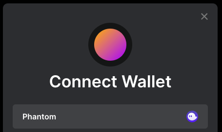

# `@solana/wallet-adapter`

Modular TypeScript wallet adapters and components for Solana applications.


## Quick Links

- [Demo](https://solana-labs.github.io/wallet-adapter/example/)
- [TypeScript Docs](https://solana-labs.github.io/wallet-adapter/)
- [FAQ (Frequently Asked Questions)](https://github.com/solana-labs/wallet-adapter/blob/master/FAQ.md)
    + [How can I get support?](https://github.com/solana-labs/wallet-adapter/blob/master/FAQ.md#how-can-i-get-support)
    + [Can I use this with ___?](https://github.com/solana-labs/wallet-adapter/blob/master/FAQ.md#can-i-use-this-with-___)
    + [What does this error mean?](https://github.com/solana-labs/wallet-adapter/blob/master/FAQ.md#what-does-this-error-mean)
    + [How can I sign and verify messages?](https://github.com/solana-labs/wallet-adapter/blob/master/FAQ.md#how-can-i-sign-and-verify-messages)
- [Quick Setup (using React UI)](#quick-setup-using-react-ui)
    + [Install](#install)
    + [Setup](#setup)
    + [Usage](#usage)
- [Packages](#packages)
    + [Core](#core)
    + [UI Components](#ui-components)
    + [Starter Projects](#starter-projects)
    + [Wallets](#wallets)
- [Build from Source](#build-from-source)

## Quick Setup (using React UI)

There are also [material-ui](https://github.com/solana-labs/wallet-adapter/tree/master/packages/ui/material-ui) and [ant-design](https://github.com/solana-labs/wallet-adapter/tree/master/packages/ui/ant-design) packages if you use those component frameworks.

### Install

Install these dependencies:

```shell
yarn add @solana/wallet-adapter-wallets \
         @solana/wallet-adapter-base \
         @solana/wallet-adapter-react \
         @solana/wallet-adapter-react-ui \
         @solana/web3.js \
         react
```

### Setup

```tsx
import React, { FC, useMemo } from 'react';
import { ConnectionProvider, WalletProvider } from '@solana/wallet-adapter-react';
import { WalletAdapterNetwork } from '@solana/wallet-adapter-base';
import {
    getLedgerWallet,
    getPhantomWallet,
    getSlopeWallet,
    getSolflareWallet,
    getSolletExtensionWallet,
    getSolletWallet,
    getTorusWallet,
} from '@solana/wallet-adapter-wallets';
import {
    WalletModalProvider,
    WalletDisconnectButton,
    WalletMultiButton
} from '@solana/wallet-adapter-react-ui';
import { clusterApiUrl } from '@solana/web3.js';

// Default styles that can be overridden by your app
require('@solana/wallet-adapter-react-ui/styles.css');

export const Wallet: FC = () => {
    // Can be set to 'devnet', 'testnet', or 'mainnet-beta'
    const network = WalletAdapterNetwork.Devnet;

    // You can also provide a custom RPC endpoint
    const endpoint = useMemo(() => clusterApiUrl(network), [network]);

    // @solana/wallet-adapter-wallets includes all the adapters but supports tree shaking --
    // Only the wallets you configure here will be compiled into your application
    const wallets = useMemo(() => [
        getPhantomWallet(),
        getSlopeWallet(),
        getSolflareWallet(),
        getTorusWallet({
            options: { clientId: 'Get a client ID @ https://developer.tor.us' }
        }),
        getLedgerWallet(),
        getSolletWallet({ network }),
        getSolletExtensionWallet({ network }),
    ], [network]);

    return (
        <ConnectionProvider endpoint={endpoint}>
            <WalletProvider wallets={wallets} autoConnect>
                <WalletModalProvider>
                    <WalletMultiButton />
                    <WalletDisconnectButton />
                </WalletModalProvider>
            </WalletProvider>
        </ConnectionProvider>
    );
};
```

You can pass in these optional display props to `WalletModalProvider`:

| prop            | type        | default     | description                                                   |
| --------------- | ----------- | ----------- | ------------------------------------------------------------- |
| className       | `string`    | `""`        | additional modal class name                                   |
| logo            | `ReactNode` | `undefined` | your logo url or image element                                |
| featuredWallets | `number`    | `3`         | initial number of wallets to display in the modal             |
| container       | `string`    | `"body"`    | CSS selector for the container element to append the modal to |

For example, to show your logo:

```tsx
<WalletModalProvider logo="YOUR_LOGO_URL">...</WalletModalProvider>
```



_Modal logo example_

### Usage

```tsx
import { WalletNotConnectedError } from '@solana/wallet-adapter-base';
import { useConnection, useWallet } from '@solana/wallet-adapter-react';
import { Keypair, SystemProgram, Transaction } from '@solana/web3.js';
import React, { FC, useCallback } from 'react';

export const SendOneLamportToRandomAddress: FC = () => {
    const { connection } = useConnection();
    const { publicKey, sendTransaction } = useWallet();

    const onClick = useCallback(async () => {
        if (!publicKey) throw new WalletNotConnectedError();

        const transaction = new Transaction().add(
            SystemProgram.transfer({
                fromPubkey: publicKey,
                toPubkey: Keypair.generate().publicKey,
                lamports: 1,
            })
        );

        const signature = await sendTransaction(transaction, connection);

        await connection.confirmTransaction(signature, 'processed');
    }, [publicKey, sendTransaction, connection]);

    return (
        <button onClick={onClick} disabled={!publicKey}>
            Send 1 lamport to a random address!
        </button>
    );
};
```

## Packages
This library is organized into small packages with few dependencies.
To add it to your dApp, you only need the core packages and UI components for your chosen framework.

### Core
These packages are what most projects can use to support wallets on Solana.

| package                                                                                       | description                                           | npm                                                                                            |
| --------------------------------------------------------------------------------------------- | ----------------------------------------------------- | ---------------------------------------------------------------------------------------------- |
| [wallets](https://github.com/solana-labs/wallet-adapter/tree/master/packages/core/wallets)    | All wallets with icons                                | [`@solana/wallet-adapter-wallets`](https://npmjs.com/package/@solana/wallet-adapter-wallets)   |
| [base](https://github.com/solana-labs/wallet-adapter/tree/master/packages/core/base)          | Adapter interfaces, error types, and common utilities | [`@solana/wallet-adapter-base`](https://npmjs.com/package/@solana/wallet-adapter-base)         |
| [react](https://github.com/solana-labs/wallet-adapter/tree/master/packages/core/react)        | Contexts and hooks for React dApps                    | [`@solana/wallet-adapter-react`](https://npmjs.com/package/@solana/wallet-adapter-react)       |
| [angular](https://github.com/solana-labs/wallet-adapter/tree/master/packages/core/angular) \* | Stores and configuration for Angular dApps            | [`@solana/wallet-adapter-angular`](https://npmjs.com/package/@solana/wallet-adapter-angular)   |
| [vue](https://github.com/solana-labs/wallet-adapter/tree/master/packages/core/vue)            | Stores and composables for Vue 3 dApps                | [`@solana/wallet-adapter-vue`](https://npmjs.com/package/@solana/wallet-adapter-vue)           |
| [svelte](https://github.com/solana-labs/wallet-adapter/tree/master/packages/core/svelte) \*   | Stores for Svelte dApps                               | [`@solana/wallet-adapter-svelte`](https://www.npmjs.com/package/@solana/wallet-adapter-svelte) |

\* Package has not been published to NPM yet.

### UI Components
These packages provide components for common UI frameworks.

| package                                                                                          | description                                           | npm                                                                                                  |
| ------------------------------------------------------------------------------------------------ | ----------------------------------------------------- | ---------------------------------------------------------------------------------------------------- |
| [material-ui](https://github.com/solana-labs/wallet-adapter/tree/master/packages/ui/material-ui) | Components for [Material UI](https://material-ui.com) | [`@solana/wallet-adapter-material-ui`](https://npmjs.com/package/@solana/wallet-adapter-material-ui) |
| [ant-design](https://github.com/solana-labs/wallet-adapter/tree/master/packages/ui/ant-design)   | Components for [Ant Design](https://ant.design)       | [`@solana/wallet-adapter-ant-design`](https://npmjs.com/package/@solana/wallet-adapter-ant-design)   |
| [react-ui](https://github.com/solana-labs/wallet-adapter/tree/master/packages/ui/react-ui)       | Components for React (no UI framework, just CSS)      | [`@solana/wallet-adapter-react-ui`](https://npmjs.com/package/@solana/wallet-adapter-react-ui)       |
| [vue-ui](https://github.com/solana-labs/wallet-adapter/tree/master/packages/ui/vue-ui)           | Components for Vue (no UI framework, just CSS)        | [`@solana/wallet-adapter-vue-ui`](https://npmjs.com/package/@solana/wallet-adapter-vue-ui)           |

### Starter Projects
These packages provide projects that you can use to start building a dApp with built-in wallet support.
Alternatively, check out [dapp-scaffold](https://github.com/solana-labs/dapp-scaffold) for a more complete framework.

| package                                                                                                               | description                                                                | npm                                                                                                                  |
| --------------------------------------------------------------------------------------------------------------------- | -------------------------------------------------------------------------- | -------------------------------------------------------------------------------------------------------------------- |
| [example](https://github.com/solana-labs/wallet-adapter/tree/master/packages/starter/example)                         | Demo of UI components                                                      | [`@solana/wallet-adapter-example`](https://npmjs.com/package/@solana/wallet-adapter-example)                         |
| [material-ui-starter](https://github.com/solana-labs/wallet-adapter/tree/master/packages/starter/material-ui-starter) | [Create React App](https://create-react-app.dev) project using Material UI | [`@solana/wallet-adapter-material-ui-starter`](https://npmjs.com/package/@solana/wallet-adapter-material-ui-starter) |
| [react-ui-starter](https://github.com/solana-labs/wallet-adapter/tree/master/packages/starter/react-ui-starter)       | [Create React App](https://create-react-app.dev) project using React UI    | [`@solana/wallet-adapter-react-ui-starter`](https://npmjs.com/package/@solana/wallet-adapter-react-ui-starter)       |
| [nextjs-starter](https://github.com/solana-labs/wallet-adapter/tree/master/packages/starter/nextjs-starter)           | [Next.js](https://nextjs.org) project using React                          | [`@solana/wallet-adapter-nextjs-starter`](https://npmjs.com/package/@solana/wallet-adapter-nextjs-starter)           |

### Wallets
These packages provide adapters for each wallet.
The core [wallets](https://github.com/solana-labs/wallet-adapter/tree/master/packages/wallets) package already includes them, so you don't need to add these as dependencies.

| package                                                                                                      | description                                            | npm                                                                                                      |
| ------------------------------------------------------------------------------------------------------------ | ------------------------------------------------------ | -------------------------------------------------------------------------------------------------------- |
| [bitkeep](https://github.com/solana-labs/wallet-adapter/tree/master/packages/bitkeep)                        | Adapter for [BitKeep](https://bitkeep.com)             | [`@solana/wallet-adapter-bitkeep`](https://npmjs.com/package/@solana/wallet-adapter-bitkeep)             |
| [bitpie](https://github.com/solana-labs/wallet-adapter/tree/master/packages/wallets/bitpie)                  | Adapter for [Bitpie](https://bitpie.com)               | [`@solana/wallet-adapter-bitpie`](https://npmjs.com/package/@solana/wallet-adapter-bitpie)               |
| [blocto](https://github.com/solana-labs/wallet-adapter/tree/master/packages/wallets/blocto)                  | Adapter for [Blocto](https://blocto.app)               | [`@solana/wallet-adapter-blocto`](https://npmjs.com/package/@solana/wallet-adapter-blocto)               |
| [clover](https://github.com/solana-labs/wallet-adapter/tree/master/packages/wallets/clover)                  | Adapter for [Clover](https://clover.finance)           | [`@solana/wallet-adapter-clover`](https://npmjs.com/package/@solana/wallet-adapter-clover)               |
| [coin98](https://github.com/solana-labs/wallet-adapter/tree/master/packages/wallets/coin98)                  | Adapter for [Coin98](https://coin98.com)               | [`@solana/wallet-adapter-coin98`](https://npmjs.com/package/@solana/wallet-adapter-coin98)               |
| [ledger](https://github.com/solana-labs/wallet-adapter/tree/master/packages/wallets/ledger)                  | Adapter for [Ledger](https://ledger.com)               | [`@solana/wallet-adapter-ledger`](https://npmjs.com/package/@solana/wallet-adapter-ledger)               |
| [mathwallet](https://github.com/solana-labs/wallet-adapter/tree/master/packages/wallets/mathwallet)          | Adapter for [MathWallet](https://mathwallet.org)       | [`@solana/wallet-adapter-mathwallet`](https://npmjs.com/package/@solana/wallet-adapter-mathwallet)       |
| [phantom](https://github.com/solana-labs/wallet-adapter/tree/master/packages/wallets/phantom)                | Adapter for [Phantom](https://phantom.app)             | [`@solana/wallet-adapter-phantom`](https://npmjs.com/package/@solana/wallet-adapter-phantom)             |
| [safepal](https://github.com/solana-labs/wallet-adapter/tree/master/packages/wallets/safepal)                | Adapter for [SafePal](https://safepal.io)              | [`@solana/wallet-adapter-safepal`](https://npmjs.com/package/@solana/wallet-adapter-safepal)             |
| [slope](https://github.com/solana-labs/wallet-adapter/tree/master/packages/wallets/slope)                    | Adapter for [Slope](https://slope.finance)             | [`@solana/wallet-adapter-slope`](https://npmjs.com/package/@solana/wallet-adapter-slope)                 |
| [solflare](https://github.com/solana-labs/wallet-adapter/tree/master/packages/wallets/solflare)              | Adapter for [Solflare](https://solflare.com)           | [`@solana/wallet-adapter-solflare`](https://npmjs.com/package/@solana/wallet-adapter-solflare)           |
| [sollet](https://github.com/solana-labs/wallet-adapter/tree/master/packages/wallets/sollet)                  | Adapter for [Sollet](https://sollet.io)                | [`@solana/wallet-adapter-sollet`](https://npmjs.com/package/@solana/wallet-adapter-sollet)               |
| [solong](https://github.com/solana-labs/wallet-adapter/tree/master/packages/wallets/solong)                  | Adapter for [Solong](https://solongwallet.com)         | [`@solana/wallet-adapter-solong`](https://npmjs.com/package/@solana/wallet-adapter-solong)               |
| [tokenpocket](https://github.com/solana-labs/wallet-adapter/tree/master/packages/wallets/tokenpocket)        | Adapter for [TokenPocket](https://tokenpocket.pro)     | [`@solana/wallet-adapter-tokenpocket`](https://npmjs.com/package/@solana/wallet-adapter-tokenpocket)     |
| [torus](https://github.com/solana-labs/wallet-adapter/tree/master/packages/wallets/torus)                    | Adapter for [Torus](https://tor.us)                    | [`@solana/wallet-adapter-torus`](https://npmjs.com/package/@solana/wallet-adapter-torus)                 |
| [walletconnect](https://github.com/solana-labs/wallet-adapter/tree/master/packages/wallets/walletconnect) \* | Adapter for [WalletConnect](https://walletconnect.org) | [`@solana/wallet-adapter-walletconnect`](https://npmjs.com/package/@solana/wallet-adapter-walletconnect) |

\* Package has not been published to NPM yet.

## Build from Source

1. Clone the project:
```shell
git clone https://github.com/solana-labs/wallet-adapter.git
```

2. Install dependencies:
```shell
cd wallet-adapter
yarn install
```

3. Build all packages:
```shell
yarn build
```

4. Run locally:
```shell
cd packages/starter/react-ui-starter
yarn start
```
