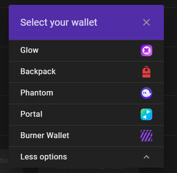

# `@solana/wallet-adapter`

Modular TypeScript wallet adapters and components for Solana applications.

 

<!-- @TODO -->

## Quick Links

- [Docs](https://solana-labs.github.io/wallet-adapter/)
- [Example](https://solana-labs.github.io/wallet-adapter/example/)

## Packages

| package                                                                                                       | description                                                                      | npm                                                                                                                      | version |
|---------------------------------------------------------------------------------------------------------------|----------------------------------------------------------------------------------|--------------------------------------------------------------------------------------------------------------------------|---------|
| [wallets](https://github.com/solana-labs/wallet-adapter/tree/master/packages/wallets)                         | All wallets with icons                                                           | [`@solana/wallet-adapter-wallets`](https://www.npmjs.com/package/@solana/wallet-adapter-wallets)                         | `0.7.0` |
| [react](https://github.com/solana-labs/wallet-adapter/tree/master/packages/react)                             | React hooks and context for dApps                                                | [`@solana/wallet-adapter-react`](https://www.npmjs.com/package/@solana/wallet-adapter-react)                             | `0.8.0` |
| [base](https://github.com/solana-labs/wallet-adapter/tree/master/packages/base)                               | Adapter interface, errors, and utilities                                         | [`@solana/wallet-adapter-base`](https://www.npmjs.com/package/@solana/wallet-adapter-base)                               | `0.5.0` |
| [phantom](https://github.com/solana-labs/wallet-adapter/tree/master/packages/phantom)                         | Adapter for [Phantom](https://www.phantom.app)                                   | [`@solana/wallet-adapter-phantom`](https://www.npmjs.com/package/@solana/wallet-adapter-phantom)                         | `0.5.0` |
| [solflare](https://github.com/solana-labs/wallet-adapter/tree/master/packages/solflare)                       | Adapter for [Solflare](https://solflare.com)                                     | [`@solana/wallet-adapter-solflare`](https://www.npmjs.com/package/@solana/wallet-adapter-solflare)                       | `0.2.0` |
| [torus](https://github.com/solana-labs/wallet-adapter/tree/master/packages/torus)                             | Adapter for [Torus](https://tor.us)                                              | [`@solana/wallet-adapter-torus`](https://www.npmjs.com/package/@solana/wallet-adapter-torus)                             | `0.6.0` |
| [ledger](https://github.com/solana-labs/wallet-adapter/tree/master/packages/ledger)                           | Adapter for [Ledger](https://www.ledger.com)                                     | [`@solana/wallet-adapter-ledger`](https://www.npmjs.com/package/@solana/wallet-adapter-ledger)                           | `0.5.0` |
| [sollet](https://github.com/solana-labs/wallet-adapter/tree/master/packages/sollet)                           | Adapter for [Sollet](https://www.sollet.io)                                      | [`@solana/wallet-adapter-sollet`](https://www.npmjs.com/package/@solana/wallet-adapter-sollet)                           | `0.5.0` |
| [solong](https://github.com/solana-labs/wallet-adapter/tree/master/packages/solong)                           | Adapter for [Solong](https://solongwallet.com)                                   | [`@solana/wallet-adapter-solong`](https://www.npmjs.com/package/@solana/wallet-adapter-solong)                           | `0.5.0` |
| [mathwallet](https://github.com/solana-labs/wallet-adapter/tree/master/packages/mathwallet)                   | Adapter for [MathWallet](https://mathwallet.org)                                 | [`@solana/wallet-adapter-mathwallet`](https://www.npmjs.com/package/@solana/wallet-adapter-mathwallet)                   | `0.5.0` |
| [coin98](https://github.com/solana-labs/wallet-adapter/tree/master/packages/coin98)                           | Adapter for [Coin98](https://coin98.com)                                         | [`@solana/wallet-adapter-coin98`](https://www.npmjs.com/package/@solana/wallet-adapter-coin98)                           | `0.1.0` |
| [bitpie](https://github.com/solana-labs/wallet-adapter/tree/master/packages/bitpie)                           | Adapter for [Bitpie](https://bitpie.com)                                         | [`@solana/wallet-adapter-bitpie`](https://www.npmjs.com/package/@solana/wallet-adapter-bitpie)                           | `0.1.0` |
| [walletconnect](https://github.com/solana-labs/wallet-adapter/tree/master/packages/walletconnect)             | Adapter for [WalletConnect](https://walletconnect.org)                           | [`@solana/wallet-adapter-walletconnect`](https://www.npmjs.com/package/@solana/wallet-adapter-walletconnect)             | `0.1.0` |
| [material-ui](https://github.com/solana-labs/wallet-adapter/tree/master/packages/material-ui)                 | Components for [Material UI](https://material-ui.com)                            | [`@solana/wallet-adapter-material-ui`](https://www.npmjs.com/package/@solana/wallet-adapter-material-ui)                 | `0.8.0` |
| [ant-design](https://github.com/solana-labs/wallet-adapter/tree/master/packages/ant-design)                   | Components for [Ant Design](https://ant.design)                                  | [`@solana/wallet-adapter-ant-design`](https://www.npmjs.com/package/@solana/wallet-adapter-ant-design)                   | `0.3.0` |
| [material-ui-starter](https://github.com/solana-labs/wallet-adapter/tree/master/packages/material-ui-starter) | [Create React App](https://create-react-app.dev) project using Material UI       | [`@solana/wallet-adapter-material-ui-starter`](https://www.npmjs.com/package/@solana/wallet-adapter-material-ui-starter) | `0.5.0` |
| [example](https://github.com/solana-labs/wallet-adapter/tree/master/packages/example)                         | Demo of components                                                               | [`@solana/wallet-adapter-example`](https://www.npmjs.com/package/@solana/wallet-adapter-example)                         | `0.8.0` |

## Quick Setup (using React with Material UI)

See the [material-ui-starter](https://github.com/solana-labs/wallet-adapter/tree/master/packages/material-ui-starter) package for a more complete example.

### Install

Install these peer dependencies (or skip this if you have them already):
```shell
yarn add @material-ui/core \
         @material-ui/icons \
         @solana/web3.js \
         react
```

Install these dependencies:
```shell
yarn add @solana/wallet-adapter-wallets \
         @solana/wallet-adapter-react \
         @solana/wallet-adapter-material-ui \
         @solana/wallet-adapter-base
```

### Setup

```tsx
import React, { FC, useMemo } from 'react';
import { ConnectionProvider, WalletProvider } from '@solana/wallet-adapter-react';
import {
    getLedgerWallet,
    getMathWallet,
    getPhantomWallet,
    getSolflareWallet,
    getSolletWallet,
    getSolongWallet,
    getTorusWallet,
} from '@solana/wallet-adapter-wallets';
import {
    WalletDialogProvider,
    WalletDisconnectButton,
    WalletMultiButton,
} from '@solana/wallet-adapter-material-ui';
import { clusterApiUrl } from '@solana/web3.js';

export const Wallet: FC = () => {
    // @solana/wallet-adapter-wallets includes all the adapters but supports tree shaking --
    // Only the wallets you want to instantiate here will be compiled into your application
    const wallets = useMemo(() => [
        getPhantomWallet(),
        getSolflareWallet(),
        getTorusWallet({
            options: { clientId: 'Get a client ID @ https://developer.tor.us' }
        }),
        getLedgerWallet(),
        getSolongWallet(),
        getMathWallet(),
        getSolletWallet(),
        getCoin98Wallet(),
        getBitpieWallet(),
    ], []);

    // Set to 'devnet' | 'testnet' | 'mainnet-beta' or provide a custom RPC endpoint
    const endpoint = useMemo(() => clusterApiUrl('devnet'), []);

    return (
        <ConnectionProvider endpoint={endpoint}>
            <WalletProvider wallets={wallets} autoConnect>
                <WalletDialogProvider>
                    <WalletMultiButton/>
                    <WalletDisconnectButton/>
                </WalletDialogProvider>
            </WalletProvider>
        </ConnectionProvider>
    );
};
```

### Usage

```tsx
import { Button } from '@material-ui/core';
import { WalletNotConnectedError } from "@solana/wallet-adapter-base";
import { useConnection, useWallet } from '@solana/wallet-adapter-react';
import { Keypair, SystemProgram, Transaction } from '@solana/web3.js';
import React, { FC, useCallback } from 'react';

export const SendOneLamportToRandomAddress: FC = () => {
    const { connection } = useConnection();
    const { publicKey, sendTransaction } = useWallet();

    const onClick = useCallback(async () => {
        if (!publicKey) throw new WalletNotConnectedError();

        const transaction = new Transaction().add(
            SystemProgram.transfer({
                fromPubkey: publicKey,
                toPubkey: Keypair.generate().publicKey,
                lamports: 1,
            })
        );

        const signature = await sendTransaction(transaction, connection);

        await connection.confirmTransaction(signature, 'processed');
    }, [publicKey, sendTransaction, connection]);

    return <button onClick={onClick} disabled={!publicKey}>Send 1 lamport to a random address!</button>;
};
```
